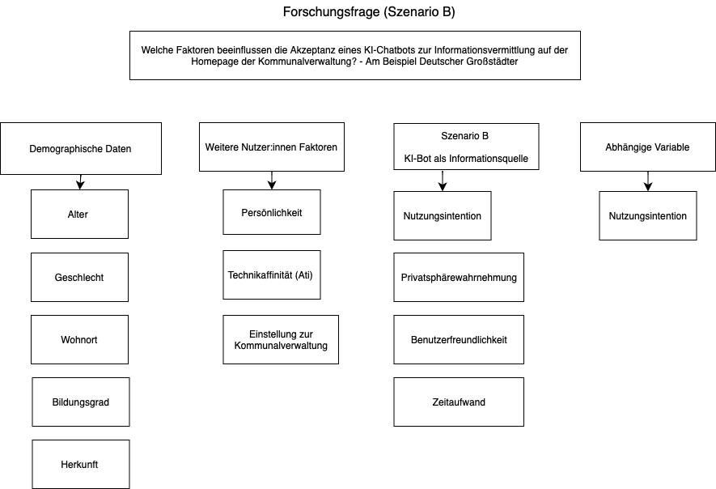

# Teammitglieder

-   ME
-   PH
-   AM

# Forschungsfrage

Welche Faktoren beeinflussen die Akzeptanz eines KI-Chatbots zur
Informationsvermittlung auf der Homepage der Kommunalverwaltung? - Am
Beispiel Deutscher Großstädter

# Faktorenraum

<figure>

<figcaption aria-hidden="true">Faktorenraum</figcaption>
</figure>

# Operationalisierung

Wir behandeln die Variable der Benutzerfreundlichkeit und verwenden
dafür die “System Usability Scale” in 10 Items.

Benutzerfreundlichkeit: System Usability Scale (SUS) nach [Lewis
(2018)](https://doi.org/10.1080/10447318.2018.1455307 "Lewis, J. R. (2018). The System Usability Scale: Past, Present, and Future. International Journal of Human-Computer Interaction, 34(7), 577–590. https://doi.org/10.1080/10447318.2018.1455307"),
übersetzt nach QUELLE in 10 Items.

# Hypothesen

Einfache Zusammenhangshypothesen

1.  Es gibt einen Zusammenhang zwischen zwischen dem Alter und der
    Nutzungsintention eines KI-Chatbots —&gt; Pearson-Korrelation

2.  Es gibt einen Zusammenhang zwischen der Technikaffinität einer
    Person und der Nutzungsintention eines KI-Chatbots —&gt;
    Pearson-Korrelation

3.  Es gibt einen Zusammenhang zwischen der Benutzerfreundlichkeit eines
    KI-Chatbots und dessen Nutzungsintention —&gt;Pearson-Korrelation

Einfache Unterschiedshypothesen

1.  Es gibt einen Unterschied in der Nutzungsintention eines KI-Chatbots
    zwischen Personen, die ihn als benutzerfreundlich wahrnehmen und
    Personen, die ihn als weniger benutzerfreundlich wahrnehmen/ Es gibt
    einen Unterschied in der Nutzungsintention eines KI-Chatbots in
    Abhängigkeit von der wahrgenommenen Benutzerfreundlichkeit —&gt;
    unverbundener T-Test

2.  Es gibt einen Unterschied in der Nutzungsintention des KI-Chatbots
    in der Kommunalverwaltung zwischen Bürgern, die den Zeitaufwand als
    gering wahrnehmen und Bürgern, die ihn als hoch wahrnehmen/ Der
    wahrgenommene Zeitaufwand beeinflusst die Nutzungsintention des
    KI-Chatbots in der Kommunalverwaltung —&gt; unverbundener T-Test

3.  Personen mit einer aufgeschlossenen Persönlichkeit haben eine höhere
    Nutzungsintention eines KI-Chatbots in der Kommunalverwaltung als
    Personen mit einer weniger aufgeschlossenen Persönlichkeit. -&gt;
    unverbundener T-Test

Komplexe Zusammenhangshypothese

1.  Je höher der Bildungsgrad und die Technikaffinität einer Person,
    desto bewusster ist die Nutzungsintention eines KI-Chatbots.

Komplexe Unterschiedshypothese

1.  Der Wohnort (ländlich, städtisch) in dem der Schulabschluss
    (niedriger Schulabschluss, mittlerer Schulabschluss, hoher
    Schulabschluss) absolviert, wurde hat einen Einfluss auf die
    Nutzungsintention.
