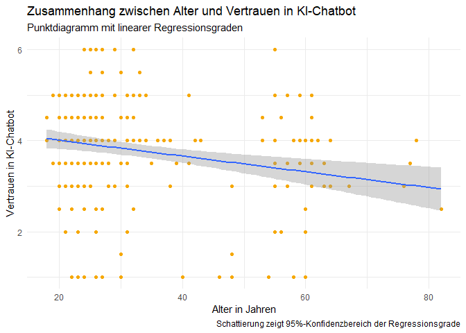
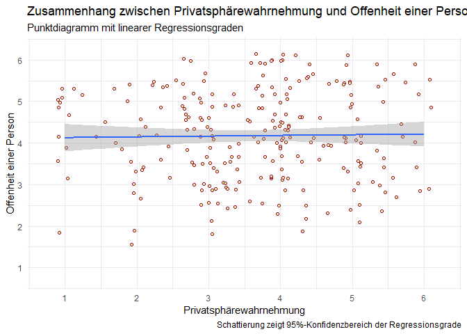
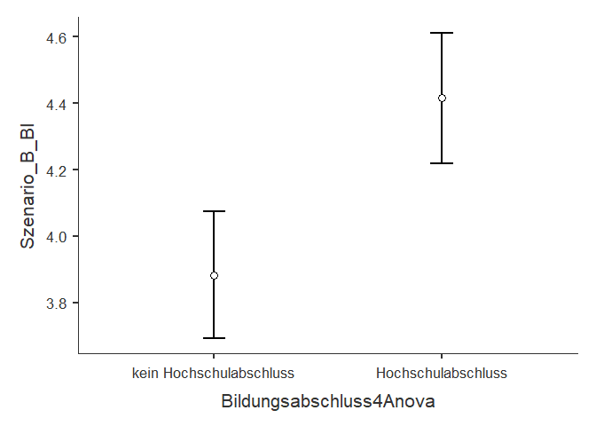
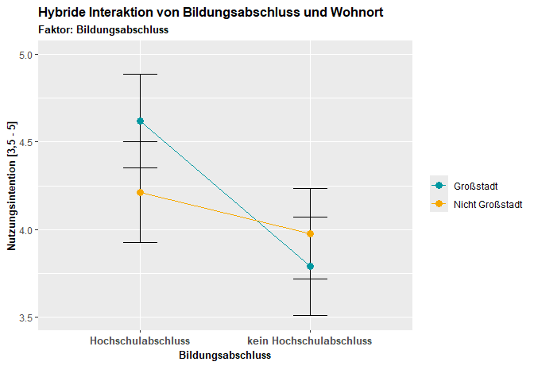
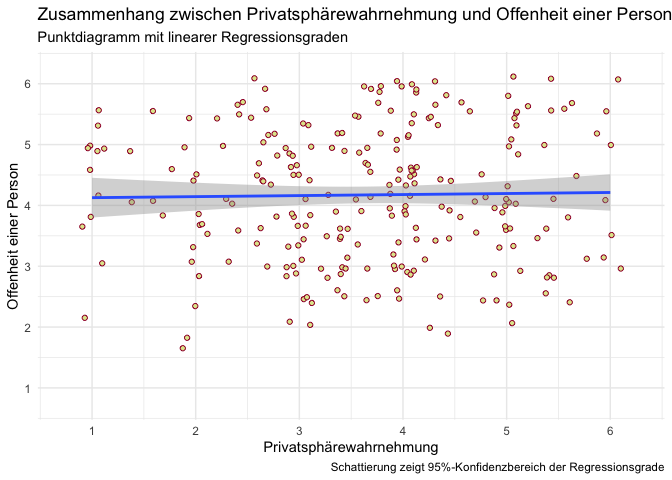

    library(tidyverse)

    ## ── Attaching core tidyverse packages ──────────────────────── tidyverse 2.0.0 ──
    ## ✔ dplyr     1.1.4     ✔ readr     2.1.5
    ## ✔ forcats   1.0.0     ✔ stringr   1.5.1
    ## ✔ ggplot2   3.5.1     ✔ tibble    3.2.1
    ## ✔ lubridate 1.9.3     ✔ tidyr     1.3.1
    ## ✔ purrr     1.0.2     
    ## ── Conflicts ────────────────────────────────────────── tidyverse_conflicts() ──
    ## ✖ dplyr::filter() masks stats::filter()
    ## ✖ dplyr::lag()    masks stats::lag()
    ## ℹ Use the conflicted package (<http://conflicted.r-lib.org/>) to force all conflicts to become errors

    library(ggthemes)
    library(AachenColorPalette)
    library(jmv)

    df <- readRDS("data/data.rds")

# Teammitglieder

-   PH
-   AM

# Forschungsfrage

Welche Faktoren beeinflussen die Akzeptanz eines KI-Chatbots zur
Informationsvermittlung auf der Homepage der Kommunalverwaltung? - Am
Beispiel Deutscher Großstädter

# Faktorenraum

<figure>

<figcaption aria-hidden="true">Faktorenraum</figcaption>
</figure>

# Operationalisierung

Wir behandeln die Variable der Benutzerfreundlichkeit und verwenden
dafür die “System Usability Scale” in 10 Items.

Benutzerfreundlichkeit: System Usability Scale (SUS) nach [Lewis
(2018)](https://doi.org/10.1080/10447318.2018.1455307 "Lewis, J. R. (2018). The System Usability Scale: Past, Present, and Future. International Journal of Human-Computer Interaction, 34(7), 577–590. https://doi.org/10.1080/10447318.2018.1455307"),
übersetzt nach QUELLE in 10 Items.

Alter: intervallskaliert

Geschlecht: nominalskaliert

Wohnort:ordinalskaliert

Bildungsgrad:ordinalskaliert

Persönlichkeit (Big 5): intervallskaliert -&gt; Likert-Skala (10 Items)
<https://zis.gesis.org/skala/Rammstedt-Kemper-Klein-Beierlein-Kovaleva-Big-Five-Inventory-(BFI-10)>

Technikaffinität (ATI): intervallskaliert -&gt; Likert-Skala (9 Items)
<https://ati-scale.org/assets/scales/ati-scala_german_2022-02-25.pdf>

Einstellung zur Kommunalverwaltung: intervallskaliert -&gt; Likert-Skala
(4 Items) unpublizierte Masterarbeit am HCIC

Benutzerfreundlichkeit: intervallskaliert -&gt; Likert-Skala (5 Items)
Items selbst formuliert in Ahnlehnung an Verständlichkeit von
<https://github.com/moritzkoerber/TiA_Trust_in_Automation_Questionnaire/blob/master/Vertrauen-in-Automation_TiA_Fragebogen.pdf>

Zeitersparnis: intervallskaliert -&gt; Likert-Skala (2 Items)
Operationaliserung stellt Forschungslücke dar, Itemformulierung mit
ChatGPT resultiert in reflektiver Skala

Erwartung an Zeitaufwand/Zeiteffizienz: intervallskaliert -&gt;
Likert-Skala (2 Items) Operationaliserung stellt Forschungslücke dar,
Items in Anlehnung an ChatGPT umformuliert

# Hypothesen

Einfache Zusammenhangshypothesen

1.  Es gibt einen Zusammenhang zwischen dem Alter und dem Vertrauen in
    den KI-Chatbot. -&gt; Pearson-Korrelation

2.  Es gibt einen Zusammenhang zwischen der generellen Einstellung
    gegenüber der Kommunalverwaltung und dem Vertrauen in den
    KI-Chatbot. -&gt; Pearson-Korrelation

3.  Es gibt einen Zusammenhang zwischen der Nutzungsintention und dem
    Zeitaufwand. -&gt; Pearson-Korrelation

4.  Es gibt eine Zusammenhang zwischen der Privatsphärewahrnehmung und
    der Offenheit einer Person. -&gt; Pearson-Korrelation

Komplexe Zusammenhangshypothese

1.  Je besser die Einstellung gegenüber der Kommunalverwaltung und je
    höher die Technikaffinität einer Person, desto bewusster ist die
    Nutzungsintention eines KI-Chatbots. -&gt; Multiple lineare
    Regression

2.  Die Nutzungsintention eines KI-Chatbots ist abhängig von der
    Benutzerfreundlichkeit des Chatbots und der Technikaffinität einer
    Person. -&gt; Multiple lineare Regression

Komplexe Unterschiedshypothese

1.  Schulabschluss (niedriger Schulabschluss, mittlerer Schulabschluss,
    hoher Schulabschluss) und Wohnort (ländlichen oder städtischen
    Gegend) haben einen Einfluss auf die Nutzungsintention. -&gt; ANOVA

\#Poweranalyse

Bei einer Erhbung von 220 Probanden muss die Effektstärke mindesten bei
0.2677066 liegen, um bei einem Signifikanzniveau von 0,05 detektiert zu
werden. Somit ist das ein schwacher bis mittelstarker Effekt

\#Hypothesentests —- \#Zusammenhangshypothese 1 —-

    ## 
    ##  Pearson's product-moment correlation
    ## 
    ## data:  df$Age and df$Vertrauen
    ## t = 1.495, df = 698, p-value = 0.1354
    ## alternative hypothesis: true correlation is not equal to 0
    ## 95 percent confidence interval:
    ##  -0.01768193  0.13005332
    ## sample estimates:
    ##        cor 
    ## 0.05649494

\#Zusammenhangshypothese 2 —-

    cor.test(df$Behoerden, df$Vertrauen, method = "pearson")

    ## 
    ##  Pearson's product-moment correlation
    ## 
    ## data:  df$Behoerden and df$Vertrauen
    ## t = 1.7774, df = 698, p-value = 0.07594
    ## alternative hypothesis: true correlation is not equal to 0
    ## 95 percent confidence interval:
    ##  -0.007015373  0.140526234
    ## sample estimates:
    ##        cor 
    ## 0.06712236

\#Zusammenhangshypothese 3 —-

    cor.test(df$Zeitersparnis, df$Szenario_B_BI, method = "pearson")

    ## 
    ##  Pearson's product-moment correlation
    ## 
    ## data:  df$Zeitersparnis and df$Szenario_B_BI
    ## t = 1.0743, df = 698, p-value = 0.2831
    ## alternative hypothesis: true correlation is not equal to 0
    ## 95 percent confidence interval:
    ##  -0.03357469  0.11438769
    ## sample estimates:
    ##        cor 
    ## 0.04062924

\#Zusammenhangsypothese 4 —-

    cor.test(df$Privatsphäre, df$BF_Offenheit, method = "pearson")

    ## 
    ##  Pearson's product-moment correlation
    ## 
    ## data:  df$Privatsphäre and df$BF_Offenheit
    ## t = -0.24648, df = 698, p-value = 0.8054
    ## alternative hypothesis: true correlation is not equal to 0
    ## 95 percent confidence interval:
    ##  -0.08337407  0.06481879
    ## sample estimates:
    ##          cor 
    ## -0.009328859

\#komplexe Unterschiedshypothese —-

    ANOVA(df, dep = "Szenario_B_BI", factors = c("Bildungsabschluss", "Wohnort"))

    ## 
    ##  ANOVA
    ## 
    ##  ANOVA - Szenario_B_BI                                                                            
    ##  ──────────────────────────────────────────────────────────────────────────────────────────────── 
    ##                                 Sum of Squares    df     Mean Square    F             p           
    ##  ──────────────────────────────────────────────────────────────────────────────────────────────── 
    ##    Bildungsabschluss                 3.8994764      4     0.97486909    1.02237890    0.3948496   
    ##    Wohnort                           0.1565208      2     0.07826041    0.08207439    0.9212125   
    ##    Bildungsabschluss:Wohnort         4.7345840      8     0.59182300    0.62066523    0.7608799   
    ##    Residuals                       653.1681385    685     0.95353013                              
    ##  ────────────────────────────────────────────────────────────────────────────────────────────────

\#Diagrame zu den Hypothesen

Einfache Zusammenhangshypothesen

1.  Es gibt einen Zusammenhang zwischen dem Alter und dem Vertrauen in
    den KI-Chatbot.

<!-- -->

    ## `geom_smooth()` using formula = 'y ~ x'

1.  Es gibt einen Zusammenhang zwischen der generellen Einstellung
    gegenüber der Kommunalverwaltung und dem Vertrauen in den
    KI-Chatbot.

<!-- -->

    ## `geom_smooth()` using formula = 'y ~ x'

1.  Es gibt einen Zusammenhang zwischen der Nutzungsintention und dem
    Zeitaufwand.

<!-- -->

    ## `geom_smooth()` using formula = 'y ~ x'

1.  Es gibt eine Zusammenhang zwischen der Privatsphärewahrnehmung und
    der Offenheit einer Person.

<!-- -->

    ## `geom_smooth()` using formula = 'y ~ x'

Komplexe Unterschiedshypothese

1.  Schulabschluss (niedriger Schulabschluss, mittlerer Schulabschluss,
    hoher Schulabschluss) und Wohnort (ländlichen oder städtischen
    Gegend) haben einen Einfluss auf die Nutzungsintention.

<!-- -->

    ## Warning: Removed 30 rows containing non-finite outside the scale range
    ## (`stat_boxplot()`).

