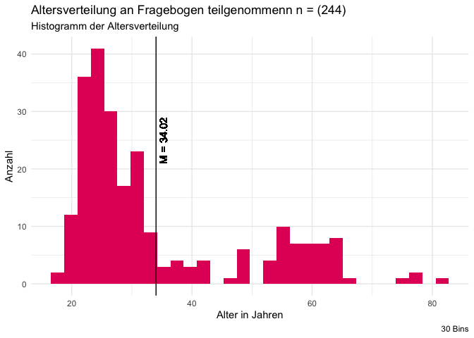

    library(tidyverse)

    ## ── Attaching core tidyverse packages ──────────────────────── tidyverse 2.0.0 ──
    ## ✔ dplyr     1.1.4     ✔ readr     2.1.5
    ## ✔ forcats   1.0.0     ✔ stringr   1.5.1
    ## ✔ ggplot2   3.5.1     ✔ tibble    3.2.1
    ## ✔ lubridate 1.9.3     ✔ tidyr     1.3.1
    ## ✔ purrr     1.0.2     
    ## ── Conflicts ────────────────────────────────────────── tidyverse_conflicts() ──
    ## ✖ dplyr::filter() masks stats::filter()
    ## ✖ dplyr::lag()    masks stats::lag()
    ## ℹ Use the conflicted package (<http://conflicted.r-lib.org/>) to force all conflicts to become errors

    library(ggthemes)
    library(AachenColorPalette)

    df <- readRDS("data/data.rds")

# Teammitglieder

-   PH
-   AM

# Forschungsfrage

Welche Faktoren beeinflussen die Akzeptanz eines KI-Chatbots zur
Informationsvermittlung auf der Homepage der Kommunalverwaltung? - Am
Beispiel Deutscher Großstädter

# Faktorenraum

<figure>

<figcaption aria-hidden="true">Faktorenraum</figcaption>
</figure>

# Operationalisierung

Wir behandeln die Variable der Benutzerfreundlichkeit und verwenden
dafür die “System Usability Scale” in 10 Items.

Benutzerfreundlichkeit: System Usability Scale (SUS) nach [Lewis
(2018)](https://doi.org/10.1080/10447318.2018.1455307 "Lewis, J. R. (2018). The System Usability Scale: Past, Present, and Future. International Journal of Human-Computer Interaction, 34(7), 577–590. https://doi.org/10.1080/10447318.2018.1455307"),
übersetzt nach QUELLE in 10 Items.

Alter: intervallskaliert

Geschlecht: nominalskaliert

Wohnort:ordinalskaliert

Bildungsgrad:ordinalskaliert

Persönlichkeit (Big 5): intervallskaliert -&gt; Likert-Skala (10 Items)
<https://zis.gesis.org/skala/Rammstedt-Kemper-Klein-Beierlein-Kovaleva-Big-Five-Inventory-(BFI-10)>

Technikaffinität (ATI): intervallskaliert -&gt; Likert-Skala (9 Items)
<https://ati-scale.org/assets/scales/ati-scala_german_2022-02-25.pdf>

Einstellung zur Kommunalverwaltung: intervallskaliert -&gt; Likert-Skala
(4 Items) unpublizierte Masterarbeit am HCIC

Benutzerfreundlichkeit: intervallskaliert -&gt; Likert-Skala (5 Items)
Items selbst formuliert in Ahnlehnung an Verständlichkeit von
<https://github.com/moritzkoerber/TiA_Trust_in_Automation_Questionnaire/blob/master/Vertrauen-in-Automation_TiA_Fragebogen.pdf>

Zeitersparnis: intervallskaliert -&gt; Likert-Skala (2 Items)
Operationaliserung stellt Forschungslücke dar, Itemformulierung mit
ChatGPT resultiert in reflektiver Skala

Erwartung an Zeitaufwand/Zeiteffizienz: intervallskaliert -&gt;
Likert-Skala (2 Items) Operationaliserung stellt Forschungslücke dar,
Items in Anlehnung an ChatGPT umformuliert

    ggplot(df) +
      aes(x = Age) +
      geom_histogram(bins = 30L, fill = aachen_color("magenta")) +
      geom_vline(xintercept = mean(df$Age, na.rm = TRUE)) +
      geom_text(x = mean(df$Age, na.rm = TRUE), y = 25, label = paste0("M = ", round(mean(df$Age, na.rm = TRUE), 2)), angle = 90 , vjust = 1.5) +
      labs(x = "Alter in Jahren", 
           y = "Anzahl", 
           title = paste0("Altersverteilung an Fragebogen teilgenommenn n = (", nrow(df), ")"),
           subtitle = "Histogramm der Altersverteilung", 
           caption = "30 Bins") +
      theme_minimal()

# Hypothesen

Einfache Zusammenhangshypothesen

1.  Es gibt einen Zusammenhang zwischen dem Alter und dem Vertrauen in
    den KI-Chatbot. -&gt; Pearson-Korrelation

2.  Es gibt einen Zusammenhang zwischen der Technikaffinität und der
    Privatsphärewahrnehmung -&gt; Pearson-Korrelation

3.  Es gibt einen Zusammenhang zwischen der wahrgenommenen
    Benutzerfreundlichkeit und Nutzungsintention -&gt;
    Pearson-Korrelation

4.  Es gibt einen Zusammenhang zwischen der generellen Einstellung
    gegenüber der Kommunalverwaltung und dem Vertrauen in den
    KI-Chatbot. -&gt; Pearson-Korrelation

5.  Es gibt einen zusammenhang zwischen der Nutzungsintention und dem
    Zeitaufwand. -&gt; Pearson-Korrelation

6.  Es gibt eine Zusammenhang zwischen der Privatsphärewahrnehmung und
    der Offenheit einer Person. -&gt; Pearson-Korrelation

Komplexe Zusammenhangshypothese

1.  Je höher der Bildungsgrad und die Technikaffinität einer Person,
    desto bewusster ist die Nutzungsintention eines KI-Chatbots. -&gt;
    Multiple lineare Regression

2.  Die Nutzungsintention eines KI-Chatbots ist abhängig vom Geschlecht
    und der Technikaffinität einer Person. -&gt; Multiple lineare
    Regression

Komplexe Unterschiedshypothese

1.  Schulabschluss (niedriger Schulabschluss, mittlerer Schulabschluss,
    hoher Schulabschluss) und Wohnort (ländlichen oder städtischen
    Gegend) haben einen Einfluss auf die Nutzungsintention. -&gt; ANOVA

\#Poweranalyse

Bei einer Erhbung von 220 Probanden muss die Effektstärke mindesten bei
0.2677066 liegen, um bei einem Signifikanzniveau von 0,05 detektiert zu
werden. Somit ist das ein schwacher bis mittelstarker Effekt
