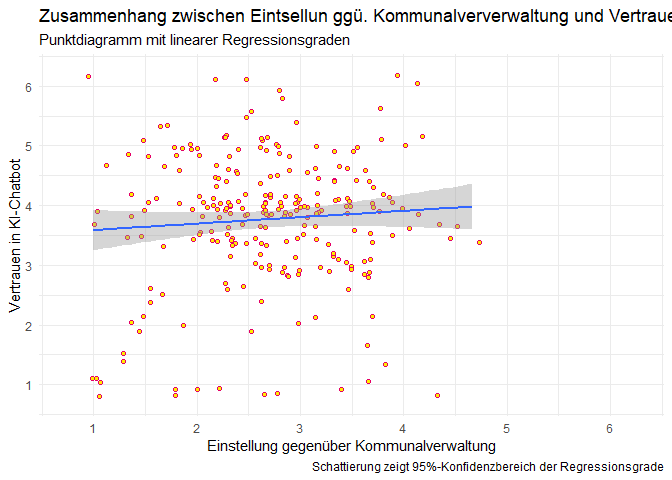
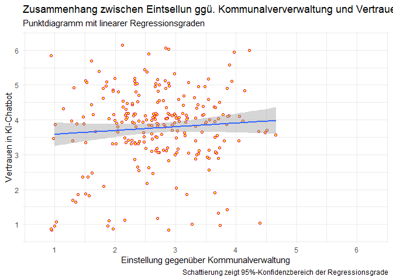
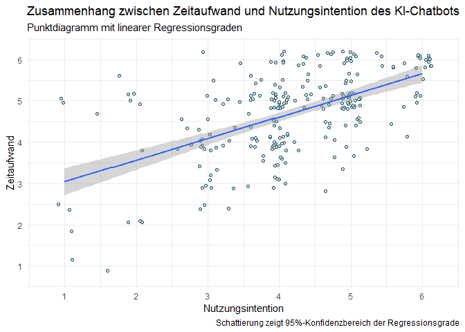

    library(tidyverse)

    ## ── Attaching core tidyverse packages ──────────────────────── tidyverse 2.0.0 ──
    ## ✔ dplyr     1.1.4     ✔ readr     2.1.5
    ## ✔ forcats   1.0.0     ✔ stringr   1.5.1
    ## ✔ ggplot2   3.5.1     ✔ tibble    3.2.1
    ## ✔ lubridate 1.9.3     ✔ tidyr     1.3.1
    ## ✔ purrr     1.0.2     
    ## ── Conflicts ────────────────────────────────────────── tidyverse_conflicts() ──
    ## ✖ dplyr::filter() masks stats::filter()
    ## ✖ dplyr::lag()    masks stats::lag()
    ## ℹ Use the conflicted package (<http://conflicted.r-lib.org/>) to force all conflicts to become errors

    library(ggthemes)
    library(AachenColorPalette)
    library(jmv)
    library(plotrix)

    df <- readRDS("data/data.rds")

# Teammitglieder

-   PH
-   AM

# Forschungsfrage

Welche Faktoren beeinflussen die Akzeptanz eines KI-Chatbots zur
Informationsvermittlung auf der Homepage der Kommunalverwaltung? - Am
Beispiel Deutscher Großstädter

# Faktorenraum

<figure>

<figcaption aria-hidden="true">Faktorenraum</figcaption>
</figure>

# Operationalisierung

Wir behandeln die Variable der Benutzerfreundlichkeit und verwenden
dafür die “System Usability Scale” in 10 Items.

Benutzerfreundlichkeit: System Usability Scale (SUS) nach [Lewis
(2018)](https://doi.org/10.1080/10447318.2018.1455307 "Lewis, J. R. (2018). The System Usability Scale: Past, Present, and Future. International Journal of Human-Computer Interaction, 34(7), 577–590. https://doi.org/10.1080/10447318.2018.1455307"),
übersetzt nach QUELLE in 10 Items.

Alter: intervallskaliert

Geschlecht: nominalskaliert

Wohnort:ordinalskaliert

Bildungsgrad:ordinalskaliert

Persönlichkeit (Big 5): intervallskaliert -&gt; Likert-Skala (10 Items)
<https://zis.gesis.org/skala/Rammstedt-Kemper-Klein-Beierlein-Kovaleva-Big-Five-Inventory-(BFI-10)>

Technikaffinität (ATI): intervallskaliert -&gt; Likert-Skala (9 Items)
<https://ati-scale.org/assets/scales/ati-scala_german_2022-02-25.pdf>

Einstellung zur Kommunalverwaltung: intervallskaliert -&gt; Likert-Skala
(4 Items) unpublizierte Masterarbeit am HCIC

Benutzerfreundlichkeit: intervallskaliert -&gt; Likert-Skala (5 Items)
Items selbst formuliert in Ahnlehnung an Verständlichkeit von
<https://github.com/moritzkoerber/TiA_Trust_in_Automation_Questionnaire/blob/master/Vertrauen-in-Automation_TiA_Fragebogen.pdf>

Zeitersparnis: intervallskaliert -&gt; Likert-Skala (2 Items)
Operationaliserung stellt Forschungslücke dar, Itemformulierung mit
ChatGPT resultiert in reflektiver Skala

Erwartung an Zeitaufwand/Zeiteffizienz: intervallskaliert -&gt;
Likert-Skala (2 Items) Operationaliserung stellt Forschungslücke dar,
Items in Anlehnung an ChatGPT umformuliert

# Hypothesen

Einfache Zusammenhangshypothesen

1.  Es gibt einen Zusammenhang zwischen dem Alter und dem Vertrauen in
    den KI-Chatbot. -&gt; Pearson-Korrelation

2.  Es gibt einen Zusammenhang zwischen der generellen Einstellung
    gegenüber der Kommunalverwaltung und dem Vertrauen in den
    KI-Chatbot. -&gt; Pearson-Korrelation

3.  Es gibt einen Zusammenhang zwischen der Nutzungsintention und dem
    Zeitaufwand. -&gt; Pearson-Korrelation

4.  Es gibt eine Zusammenhang zwischen der Privatsphärewahrnehmung und
    der Offenheit einer Person. -&gt; Pearson-Korrelation

Komplexe Zusammenhangshypothese

1.  Je besser die Einstellung gegenüber der Kommunalverwaltung und je
    höher die Technikaffinität einer Person, desto bewusster ist die
    Nutzungsintention eines KI-Chatbots. -&gt; Multiple lineare
    Regression

2.  Die Nutzungsintention eines KI-Chatbots ist abhängig von der
    Benutzerfreundlichkeit des Chatbots und der Technikaffinität einer
    Person. -&gt; Multiple lineare Regression

Komplexe Unterschiedshypothese

1.  Schulabschluss (niedriger Schulabschluss, mittlerer Schulabschluss,
    hoher Schulabschluss) und Wohnort (ländlichen oder städtischen
    Gegend) haben einen Einfluss auf die Nutzungsintention. -&gt; ANOVA

\#Poweranalyse

Bei einer Erhbung von 220 Probanden muss die Effektstärke mindesten bei
0.2677066 liegen, um bei einem Signifikanzniveau von 0,05 detektiert zu
werden. Somit ist das ein schwacher bis mittelstarker Effekt

\#Tabelle - Deskriptive Werte

    ##                alpha mean   sd  min  max
    ## BF_Offenheit    0.47 4.17 1.09 1.50 6.00
    ## ATI             0.89 3.58 0.98 1.33 5.78
    ## Behoerden       0.79 2.69 0.78 1.00 4.67
    ## Szenario_B_BI   0.94 4.16 1.10 1.00 6.00
    ## Szenario_B_ATT  0.94 4.21 1.14 1.00 6.00
    ## Privatsphäre    0.90 3.64 1.22 1.00 6.00
    ## Vertrauen       0.84 3.77 1.10 1.00 6.00
    ## Bedienbarkeit   0.78 4.78 0.76 1.00 6.00
    ## Zeitersparnis   0.84 4.69 1.02 1.00 6.00

\#Hypothesentests —- \#Zusammenhangshypothese 1 —- 1. Es gibt einen
Zusammenhang zwischen dem Alter und dem Vertrauen in den KI-Chatbot.
-&gt; Pearson-Korrelation

    ## 
    ##  Pearson's product-moment correlation
    ## 
    ## data:  df$Age and df$Vertrauen
    ## t = -3.6097, df = 237, p-value = 0.000374
    ## alternative hypothesis: true correlation is not equal to 0
    ## 95 percent confidence interval:
    ##  -0.3451796 -0.1044134
    ## sample estimates:
    ##        cor 
    ## -0.2282838

\#Diagramm zu Zusammenhangshypothe 1 —-

    ## `geom_smooth()` using formula = 'y ~ x'

    ## Warning: Removed 5 rows containing non-finite outside the scale range
    ## (`stat_smooth()`).

    ## Warning: Removed 5 rows containing missing values or values outside the scale range
    ## (`geom_point()`).

\#Zusammenhangshypothese 2 —- 2. Es gibt einen Zusammenhang zwischen der
generellen Einstellung gegenüber der Kommunalverwaltung und dem
Vertrauen in den KI-Chatbot.

    cor.test(df$Behoerden, df$Vertrauen, method = "pearson")

    ## 
    ##  Pearson's product-moment correlation
    ## 
    ## data:  df$Behoerden and df$Vertrauen
    ## t = 1.179, df = 242, p-value = 0.2395
    ## alternative hypothesis: true correlation is not equal to 0
    ## 95 percent confidence interval:
    ##  -0.05049002  0.19926953
    ## sample estimates:
    ##        cor 
    ## 0.07557501

\#Diagramm zu Zusammenhangshypothese 2 —-

    ## `geom_smooth()` using formula = 'y ~ x'

\#Zusammenhangshypothese 3 —- 3. Es gibt einen Zusammenhang zwischen der
Nutzungsintention und dem Zeitaufwand. -&gt; Pearson-Korrelation

    cor.test(df$Zeitersparnis, df$Szenario_B_BI, method = "pearson")

    ## 
    ##  Pearson's product-moment correlation
    ## 
    ## data:  df$Zeitersparnis and df$Szenario_B_BI
    ## t = 10.523, df = 242, p-value < 2.2e-16
    ## alternative hypothesis: true correlation is not equal to 0
    ## 95 percent confidence interval:
    ##  0.4676251 0.6408007
    ## sample estimates:
    ##       cor 
    ## 0.5603058

\#Diagramm zu Zusammenhangshypothese 3 —-

    ## `geom_smooth()` using formula = 'y ~ x'

\#Zusammenhangsypothese 4 —- 4. Es gibt eine Zusammenhang zwischen der
Privatsphärewahrnehmung und der Offenheit einer Person. -&gt;
Pearson-Korrelation

    cor.test(df$Privatsphäre, df$BF_Offenheit, method = "pearson")

    ## 
    ##  Pearson's product-moment correlation
    ## 
    ## data:  df$Privatsphäre and df$BF_Offenheit
    ## t = 0.29904, df = 242, p-value = 0.7652
    ## alternative hypothesis: true correlation is not equal to 0
    ## 95 percent confidence interval:
    ##  -0.1066239  0.1444564
    ## sample estimates:
    ##        cor 
    ## 0.01921928

\#Diagramm Zusammenhangshypothese 4

    ## `geom_smooth()` using formula = 'y ~ x'

\#komplexe Unterschiedshypothese —-

    table(df$Wohnort)

    ## 
    ##          Ländlich Vorort/Kleinstadt         Großstadt 
    ##                37                83               118

    table(df$Bildungsabschluss)

    ## 
    ## (noch) kein Schulabschluss        Hauptschulabschluss 
    ##                          2                         13 
    ##         Realschulabschluss                     Abitur 
    ##                         32                         76 
    ##         Hochschulabschluss 
    ##                        115

    df$Wohnort %>% 
      recode(`Ländlich` = "Nicht Großstadt", `Vorort/Kleinstadt` = "Nicht Großstadt", `Großstadt` = "Großstadt") %>% 
      as.factor() -> df$Wohnort4Anova

    df$Bildungsabschluss %>% 
      recode(`(noch) kein Schulabschluss` = "kein Hochschulabschluss", `Hauptschulabschluss` = "kein Hochschulabschluss", `Realschulabschluss` = "kein Hochschulabschluss", `Abitur` = "kein Hochschulabschluss", `Hochschulabschluss`= "Hochschulabschluss") %>% 
      as.factor() -> df$Bildungsabschluss4Anova

    #jmv::ANOVA(df, dep = Szenario_B_BI, factors = c("Bildungsabschluss4Anova", "Wohnort4Anova"))

    result <- jmv::ANOVA(df, dep = Szenario_B_BI, factors = c("Bildungsabschluss4Anova", "Wohnort4Anova"), 
               emmPlots = TRUE, emmTables = TRUE, emMeans = list(c("Bildungsabschluss4Anova"), c("Wohnort4Anova"),
                                                                 c("Bildungsabschluss4Anova", "Wohnort4Anova"),
                                                                 c("Wohnort4Anova", "Bildungsabschluss4Anova")))
    result

    ## 
    ##  ANOVA
    ## 
    ##  ANOVA - Szenario_B_BI                                                                                        
    ##  ──────────────────────────────────────────────────────────────────────────────────────────────────────────── 
    ##                                             Sum of Squares    df     Mean Square    F             p           
    ##  ──────────────────────────────────────────────────────────────────────────────────────────────────────────── 
    ##    Bildungsabschluss4Anova                      16.7003939      1     16.7003939    14.6553018    0.0001659   
    ##    Wohnort4Anova                                 0.7205473      1      0.7205473     0.6323107    0.4273183   
    ##    Bildungsabschluss4Anova:Wohnort4Anova         5.0758211      1      5.0758211     4.4542476    0.0358807   
    ##    Residuals                                   265.5142711    233      1.1395462                              
    ##  ──────────────────────────────────────────────────────────────────────────────────────────────────────────── 
    ## 
    ## 
    ##  ESTIMATED MARGINAL MEANS
    ## 
    ##  BILDUNGSABSCHLUSS4ANOVA
    ## 
    ##  Estimated Marginal Means - Bildungsabschluss4Anova                            
    ##  ───────────────────────────────────────────────────────────────────────────── 
    ##    Bildungsabschluss4Anova    Mean        SE            Lower       Upper      
    ##  ───────────────────────────────────────────────────────────────────────────── 
    ##    kein Hochschulabschluss    3.883207    0.09697279    3.692152    4.074263   
    ##    Hochschulabschluss         4.416058    0.09985070    4.219332    4.612784   
    ##  ───────────────────────────────────────────────────────────────────────────── 
    ## 
    ## 
    ##  WOHNORT4ANOVA
    ## 
    ##  Estimated Marginal Means - Wohnort4Anova                              
    ##  ───────────────────────────────────────────────────────────────────── 
    ##    Wohnort4Anova      Mean        SE            Lower       Upper      
    ##  ───────────────────────────────────────────────────────────────────── 
    ##    Nicht Großstadt    4.094292    0.09844634    3.900333    4.288251   
    ##    Großstadt          4.204973    0.09839819    4.011109    4.398837   
    ##  ───────────────────────────────────────────────────────────────────── 
    ## 
    ## 
    ##  BILDUNGSABSCHLUSS4ANOVA:WOHNORT4ANOVA
    ## 
    ##  Estimated Marginal Means - Bildungsabschluss4Anova:Wohnort4Anova                                
    ##  ─────────────────────────────────────────────────────────────────────────────────────────────── 
    ##    Wohnort4Anova      Bildungsabschluss4Anova    Mean        SE           Lower       Upper      
    ##  ─────────────────────────────────────────────────────────────────────────────────────────────── 
    ##    Nicht Großstadt    kein Hochschulabschluss    3.974747    0.1313996    3.715864    4.233631   
    ##                       Hochschulabschluss         4.213836    0.1466318    3.924943    4.502730   
    ##    Großstadt          kein Hochschulabschluss    3.791667    0.1426501    3.510618    4.072715   
    ##                       Hochschulabschluss         4.618280    0.1355720    4.351176    4.885383   
    ##  ─────────────────────────────────────────────────────────────────────────────────────────────── 
    ## 
    ## 
    ##  WOHNORT4ANOVA:BILDUNGSABSCHLUSS4ANOVA
    ## 
    ##  Estimated Marginal Means - Wohnort4Anova:Bildungsabschluss4Anova                                
    ##  ─────────────────────────────────────────────────────────────────────────────────────────────── 
    ##    Bildungsabschluss4Anova    Wohnort4Anova      Mean        SE           Lower       Upper      
    ##  ─────────────────────────────────────────────────────────────────────────────────────────────── 
    ##    kein Hochschulabschluss    Nicht Großstadt    3.974747    0.1313996    3.715864    4.233631   
    ##                               Großstadt          3.791667    0.1426501    3.510618    4.072715   
    ##    Hochschulabschluss         Nicht Großstadt    4.213836    0.1466318    3.924943    4.502730   
    ##                               Großstadt          4.618280    0.1355720    4.351176    4.885383   
    ##  ───────────────────────────────────────────────────────────────────────────────────────────────

    interaktionseffekt <- result$emm[[3]]$emmTable$asDF

\#Diagramm komplexe Unterschiedhypothese

    interaktionseffekt %>% 
      ggplot() +
      aes(x = Bildungsabschluss4Anova, y = mean, colour = Wohnort4Anova, ymin = lower, ymax = upper, group = Wohnort4Anova ) +
      geom_errorbar(width = 0.2, colour = aachen_color("black")) +
      geom_point(size = 3) +
      geom_line() +
      scale_colour_manual(values=aachen_color("turquoise","orange")) + 
      ylim(3.5,5) +
      theme_gray() +
      labs(title = "Hybride Interaktion von Bildungsabschluss und Wohnort", 
           subtitle = "Faktor: Bildungsabschluss", 
           x = "Bildungsabschluss",
           y = "Nutzungsintention [3,5 - 5]",
           colour = "",
           caption = "") +
      theme(title = element_text(face = "bold", size = 10), 
            axis.text.x = element_text(face = "bold", size = 10))

    #ggsave("anovaplotimage/C_IE1.png", width = 15, height = 10, units = "cm")

\#lineare Regression 1

    jmv::linReg(df,
                dep = c("Szenario_B_BI"),
                covs = c("Behoerden", "ATI"),
                blocks = c("ATI", "Behoerden"),
                r2Adj = TRUE, stdEst = TRUE, modelTest = TRUE)

    ## 
    ##  LINEAR REGRESSION
    ## 
    ##  Model Fit Measures                                                                         
    ##  ────────────────────────────────────────────────────────────────────────────────────────── 
    ##    Model    R            R²            Adjusted R²    F           df1    df2    p           
    ##  ────────────────────────────────────────────────────────────────────────────────────────── 
    ##        1    0.1175918    0.01382784    0.009752748    3.393258      1    242    0.0666869   
    ##        2    0.1236988    0.01530140    0.007129631    1.872470      2    241    0.1559732   
    ##  ────────────────────────────────────────────────────────────────────────────────────────── 
    ##    Note. Models estimated using sample size of N=244
    ## 
    ## 
    ##  Model Comparisons                                                              
    ##  ────────────────────────────────────────────────────────────────────────────── 
    ##    Model         Model    ΔR²            F            df1    df2    p           
    ##  ────────────────────────────────────────────────────────────────────────────── 
    ##        1    -        2    0.001473564    0.3606473      1    241    0.5487113   
    ##  ────────────────────────────────────────────────────────────────────────────── 
    ## 
    ## 
    ##  MODEL SPECIFIC RESULTS
    ## 
    ##  MODEL 1
    ## 
    ##  Model Coefficients - Szenario_B_BI                                                     
    ##  ────────────────────────────────────────────────────────────────────────────────────── 
    ##    Predictor    Estimate     SE            t            p             Stand. Estimate   
    ##  ────────────────────────────────────────────────────────────────────────────────────── 
    ##    Intercept    3.6833445    0.26650230    13.821061    < .0000001                      
    ##    ATI          0.1322287    0.07178229     1.842080     0.0666869          0.1175918   
    ##  ────────────────────────────────────────────────────────────────────────────────────── 
    ## 
    ## 
    ##  MODEL 2
    ## 
    ##  Model Coefficients - Szenario_B_BI                                                        
    ##  ───────────────────────────────────────────────────────────────────────────────────────── 
    ##    Predictor    Estimate       SE            t             p             Stand. Estimate   
    ##  ───────────────────────────────────────────────────────────────────────────────────────── 
    ##    Intercept     3.84188108    0.37536989    10.2349209    < .0000001                      
    ##    ATI           0.12884019    0.07209843     1.7870042     0.0751935         0.11457840   
    ##    Behoerden    -0.05434170    0.09048818    -0.6005392     0.5487113        -0.03850513   
    ##  ─────────────────────────────────────────────────────────────────────────────────────────

\#lineare Regression 2

\#Diagrame zu den Hypothesen

Einfache Zusammenhangshypothesen

1.  Es gibt einen Zusammenhang zwischen dem Alter und dem Vertrauen in
    den KI-Chatbot.

<!-- -->

    ## `geom_smooth()` using formula = 'y ~ x'

    ## Warning: Removed 5 rows containing non-finite outside the scale range
    ## (`stat_smooth()`).

    ## Warning: Removed 5 rows containing missing values or values outside the scale range
    ## (`geom_point()`).

1.  Es gibt einen Zusammenhang zwischen der generellen Einstellung
    gegenüber der Kommunalverwaltung und dem Vertrauen in den
    KI-Chatbot.

<!-- -->

    ## `geom_smooth()` using formula = 'y ~ x'

1.  Es gibt einen Zusammenhang zwischen der Nutzungsintention und dem
    Zeitaufwand.

<!-- -->

    ## `geom_smooth()` using formula = 'y ~ x'

1.  Es gibt eine Zusammenhang zwischen der Privatsphärewahrnehmung und
    der Offenheit einer Person.

<!-- -->

    ## `geom_smooth()` using formula = 'y ~ x'

